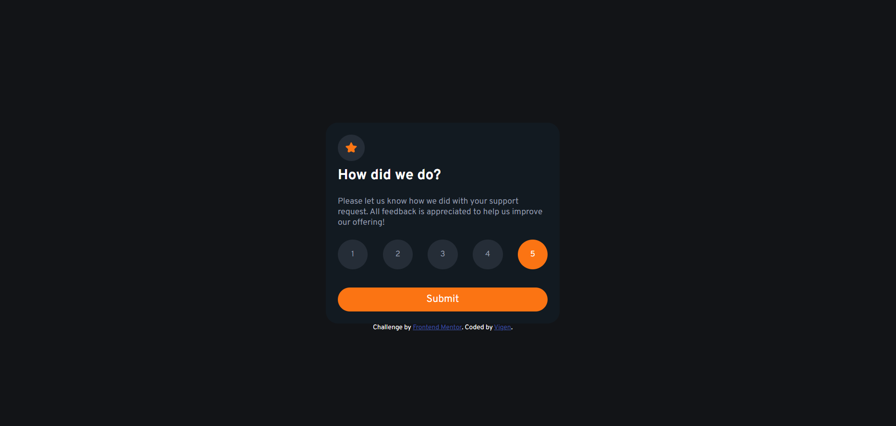

# Frontend Mentor - Interactive rating component solution

This is a solution to the [Interactive rating component challenge on Frontend Mentor](https://www.frontendmentor.io/challenges/interactive-rating-component-koxpeBUmI). Frontend Mentor challenges help you improve your coding skills by building realistic projects. 

## Table of contents

- [Overview](#overview)
  - [The challenge](#the-challenge)
  - [Screenshot](#screenshot)
  - [Links](#links)
- [My process](#my-process)
  - [Built with](#built-with)
  - [What I learned](#what-i-learned)
  - [Continued development](#continued-development)
  - [Useful resources](#useful-resources)
- [Author](#author)

**Note: Delete this note and update the table of contents based on what sections you keep.**

## Overview

### The challenge

Users should be able to:

- View the optimal layout for the app depending on their device's screen size
- See hover states for all interactive elements on the page
- Select and submit a number rating
- See the "Thank you" card state after submitting a rating

### Screenshot



### Links

- Solution URL: [My solution URL here](https://github.com/vigengareyan/interactive-rating-component-1)
- Live Site URL: [My live site URL here](https://interactive-rating-component-1.vigengareyan.repl.co/)

## My process

### Built with

- Semantic HTML5 markup
- CSS custom properties
- Flexbox
- JS


### What I learned

```js
const proudOfThisFunc = () => {
  var a = document.getElementById("submit");
  a.href="#one" ;
}
```

### Continued development

CSS Grid

### Useful resources

- [Example resource 1](https://www.codegrepper.com) - This helped me to solve problems with Submit button. I really liked this pattern and will use it going forward.
- [Example resource 2](https://jsfiddle.net/w2eox90g/#) - This is an amazing code which helped me finally understand how to make 2 webpages linked with each other. I'd recommend it to anyone still learning this concept.

## Author

- Frontend Mentor - [@vigengareyan](https://www.frontendmentor.io/profile/vigengareyan)
